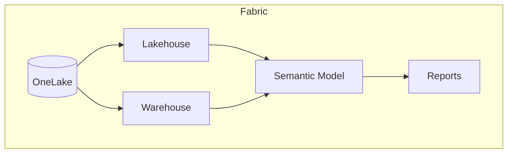
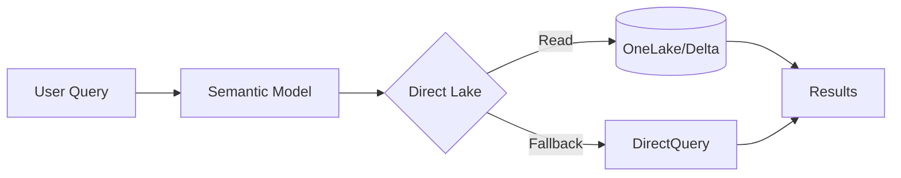

# Shared Images & Diagrams

This folder contains diagrams and images used across multiple workshop sections.

---

## Images to Create

### Architecture Diagrams
- [ ] `fabric-architecture.png` - High-level Fabric architecture
- [ ] `onelake-concept.png` - OneLake unified storage visual
- [ ] `direct-lake-flow.png` - How Direct Lake reads data

### Comparison Charts
- [ ] `pro-vs-fabric-comparison.png` - Feature comparison chart
- [ ] `storage-modes-comparison.png` - Import vs DirectQuery vs Direct Lake

### Workflow Diagrams
- [ ] `git-workflow.png` - Fabric Git integration flow
- [ ] `deployment-pipeline.png` - Dev → Test → Prod flow
- [ ] `etl-patterns.png` - Dataflow vs Pipeline vs Notebook decision tree

---

## Image Guidelines

### Format
- PNG for diagrams and screenshots
- SVG for scalable vector graphics (preferred for diagrams)

### Size
- Maximum width: 1920px
- Optimize for file size (use tools like TinyPNG)

### Style
- Use consistent colors (align with Microsoft Fabric branding)
- Include alt text descriptions
- Keep text readable at 50% zoom

---

## Tools for Creating Diagrams

- **PowerPoint** - Quick and familiar
- **Figma** - Professional design
- **draw.io** - Free, web-based
- **Mermaid** - Code-based diagrams (works in Markdown)
- **Excalidraw** - Hand-drawn style

---

## Mermaid Diagram Examples

These can be included directly in Markdown files:

### Fabric Architecture (simple)

### Direct Lake Flow

